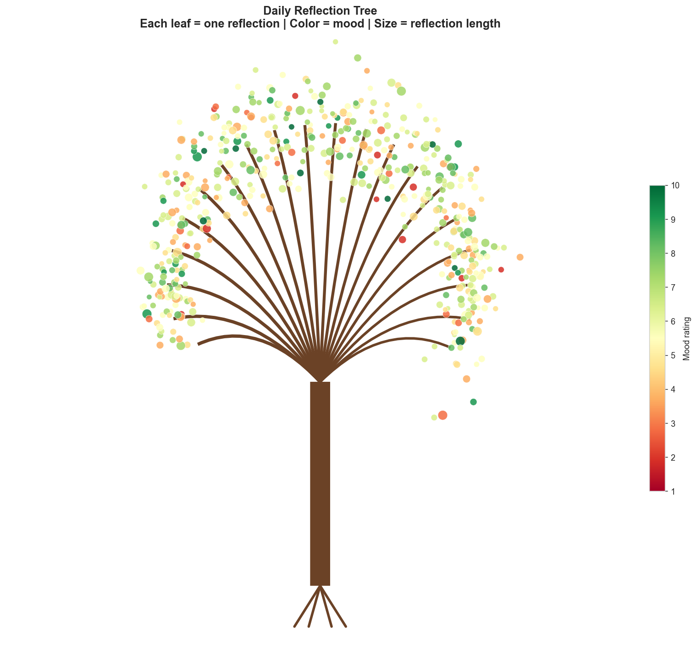

# 🌳 Daily Reflection Tree

A data science project that treats daily written reflections as a real-world textual + numerical dataset, applying the full data science lifecycle — cleaning, EDA, NLP, sentiment/emotion analysis, topic modeling, time-series analysis, and machine learning — to discover patterns in mood, productivity, and writing behavior over time.

[](https://www.python.org/)
[](https://pandas.pydata.org/)
[](https://scikit-learn.org/)
[](https://www.nltk.org/)
[](https://jupyter.org/)

---

## Problem Statement

Turning free-form daily writing into structured insight is a genuine unstructured-to-structured data problem: each day produces text (a reflection) alongside self-reported ratings (mood, energy, productivity) and free-form tags. This project asks:

- How does sentiment change over time, and does it agree with self-reported mood?
- Which topics come up most often, and how do they relate to mood and productivity?
- Are mood, energy, and productivity associated with each other — and can any of it predict tomorrow?

## Objectives

1. Clean and validate a real-world-style textual + numerical dataset
2. Perform statistically grounded exploratory analysis (not just charts for decoration)
3. Apply NLP: word frequency, TF-IDF, sentiment analysis, emotion classification, topic modeling
4. Build and honestly evaluate a machine learning model on time-dependent data
5. Communicate findings clearly, including where the analysis falls short

## Dataset

**517 synthetic daily reflection records** (Jan 2025 – Aug 2026), generated specifically for this project rather than using real private journal entries. The generator (`generate_dataset.py`) deliberately builds in realistic structure — mood/energy/productivity drawn from a shared "day quality" factor, a mild weekend productivity dip, day-to-day autocorrelation, and ~8% missed days — documented in full in Notebook 1, so every pattern the analysis finds is a real pattern in the data, not noise.

| | |
|---|---|
| Records | 517 |
| Date range | Jan 27, 2025 – Aug 9, 2026 |
| Avg. mood / energy / productivity | 5.45 / 5.44 / 5.37 (out of 10) |
| Fields | date, reflection, mood, energy, productivity, tags |

## Data Science Workflow

```
DAILY REFLECTION → DATA CLEANING → FEATURE ENGINEERING → NLP ANALYSIS
        ↓                                                      ↓
  SENTIMENT · EMOTION · TOPICS ← ─────────────────────────────┘
        ↓
  EDA + STATISTICS → TIME-SERIES → MACHINE LEARNING → KEY INSIGHTS → 🌳 TREE
```

## Notebooks

| Notebook | Covers |
|---|---|
| `01_Data_Collection_and_Cleaning.ipynb` | Data quality checks, negation-safe text cleaning, raw vs. cleaned text |
| `02_Exploratory_Data_Analysis.ipynb` | Feature engineering, univariate/bivariate analysis, correlation, time-series, day-of-week, streaks |
| `03_NLP_and_Sentiment_Analysis.ipynb` | Word frequency, bigrams/trigrams, TF-IDF, word cloud, VADER sentiment |
| `04_Emotion_and_Topic_Analysis.ipynb` | Transformer-based emotion classification, LDA topic modeling |
| `05_Machine_Learning.ipynb` | Next-day productivity prediction, chronological split, model comparison |

## Exploratory Data Analysis — Key Findings

- Mood, energy, and productivity are **moderately-to-strongly correlated** with each other (Pearson r ≈ 0.60–0.62), confirmed with Spearman as well
- `positive_word_count` correlates **+0.47** with mood and `negative_word_count` correlates **-0.46** — the reflection text and the numeric ratings genuinely agree
- Productivity shows a mild, real dip on weekends
- Overall journaling consistency: **92.3%**, longest streak **54 days**

## NLP & Sentiment Analysis

VADER sentiment (run on raw, uncleaned text to preserve punctuation/context signal) was compared against mood ratings. TF-IDF was used over raw frequency to surface topically distinctive terms — raw frequency was dominated by generic connector words, an honest artifact of the templated synthetic text, documented directly in the notebook rather than hidden.

## Emotion Detection & Topic Modeling

Emotion classification uses a Hugging Face transformer model (`j-hartmann/emotion-english-distilroberta-base`) — explicitly documented as an NLP classification task, **not** a psychological or medical assessment. Topic modeling (LDA, 7 topics) cleanly separated reflections into distinguishable themes (work, rest, learning, social, travel/positive, uncertainty/planning, general).

## Machine Learning — Predicting Next-Day Productivity

**Chronological** train/test split (not random, to avoid lookahead leakage on time-dependent data). Compared Linear Regression, Random Forest, and Gradient Boosting against a mean-prediction baseline:

| Model | MAE | RMSE | R² |
|---|---|---|---|
| Linear Regression | 1.644 | 2.029 | -0.107 |
| Random Forest | 1.675 | 2.052 | -0.132 |
| Gradient Boosting | 1.783 | 2.181 | -0.279 |
| Baseline (predict mean) | 1.658 | 2.037 | 0.000 |

**Honest result: none of the models meaningfully beat the baseline.** This is reported as-is rather than adjusted to look better — with ~500 records and a deliberately weak autocorrelation signal in the synthetic data, this is the expected, defensible outcome. See Notebook 5 for full discussion.

## The Reflection Tree



Every visual property maps to real data: **roots** = the start of the journaling journey, **trunk** = overall consistency, **branches** = months, **leaves** = individual reflections (color = mood, size = reflection length).

## Key Insights

1. Mood, energy, and productivity move together — a bad day tends to be bad across all three, not just one
2. The text people write is honestly consistent with how they rate their day — a good sign for any future sentiment-based feature
3. Next-day productivity is **not reliably predictable** from the available features alone at this sample size — a real, useful negative result
4. Journaling consistency (92.3%) was high enough to support meaningful streak and time-series analysis

## Limitations

- Synthetic dataset — patterns reflect the generator's design, not real human behavior
- ~500 records is small for machine learning; results should not be over-generalized
- Self-reported ratings are inherently subjective
- Correlation and feature importance describe association, never causation
- Emotion/sentiment models can misclassify nuanced or sarcastic text

## Future Improvements

- Real-world dataset (with consent and full anonymization)
- Larger sample size for more reliable ML modeling
- Multilingual sentiment analysis
- More advanced topic modeling (BERTopic)
- Explainable AI (SHAP) for model interpretability

## Technologies Used

Python · Pandas · NumPy · Matplotlib · Seaborn · SciPy · scikit-learn · NLTK · VADER · WordCloud · Hugging Face Transformers · Jupyter Notebook

## Project Structure

```
Daily-Reflection-Tree/
├── data/
│   ├── raw/daily_reflections.csv
│   └── processed/
├── notebooks/
│   ├── 01_Data_Collection_and_Cleaning.ipynb
│   ├── 02_Exploratory_Data_Analysis.ipynb
│   ├── 03_NLP_and_Sentiment_Analysis.ipynb
│   ├── 04_Emotion_and_Topic_Analysis.ipynb
│   └── 05_Machine_Learning.ipynb
├── visualizations/
├── generate_dataset.py
├── requirements.txt
├── .gitignore
└── README.md
```

## How to Run

```bash
git clone https://github.com/suniyal416-byte/Daily-Reflection-Tree.git
cd Daily-Reflection-Tree
pip install -r requirements.txt
python -m nltk.downloader punkt punkt_tab stopwords wordnet
jupyter notebook
```
Run the notebooks in order, 01 → 05.

## Author

**Subhash Uniyal**
Data Analyst & Aspiring Data Scientist | Python · SQL · Power BI · Excel
[GitHub](https://github.com/suniyal416-byte) · [LinkedIn](https://linkedin.com/in/suniyal416-byte)
